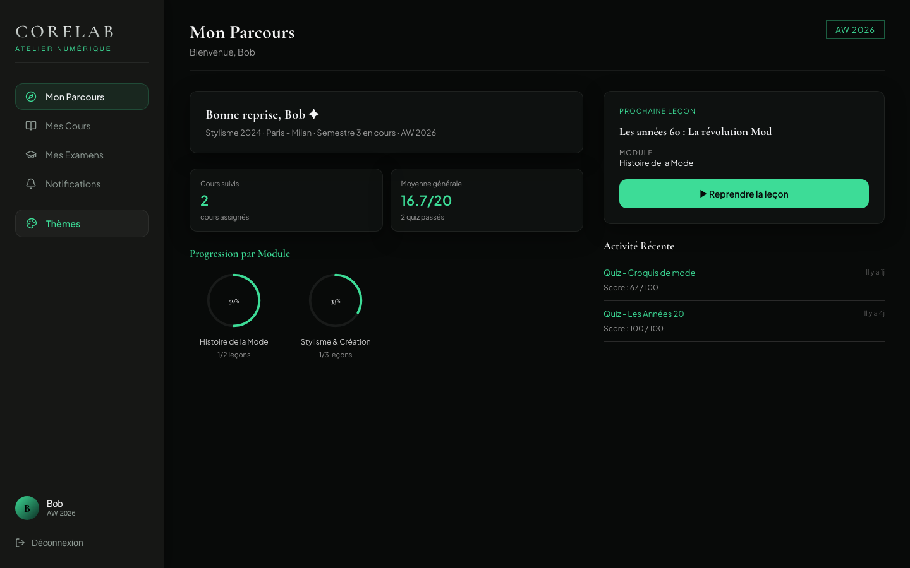
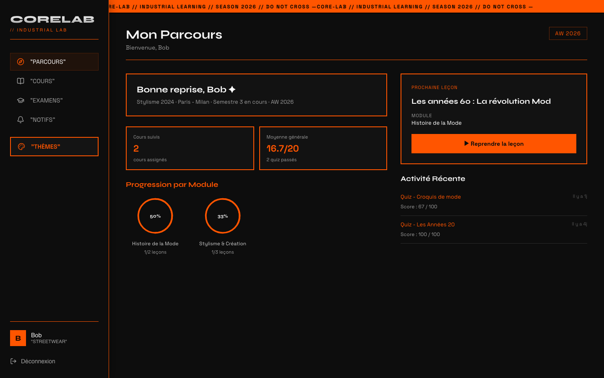

# Corelab - LMS E-learning

> Plateforme de gestion de formations (Learning Management System) développée avec la stack MERN.

---

## Aperçu

<p align="center">
  
</p>

<table>
  <tr>
    <td width="50%"></td>
    <td width="50%"></td>
  </tr>
  <tr>
    <td align="center"><em>Espace administrateur</em></td>
    <td align="center"><em>Espace étudiant — thème Haute Couture</em></td>
  </tr>
</table>

---

## 🆕 Nouveautés V2

> Cette V2 (frontend **et** backend : refonte UI, système de thèmes, animations, correctifs de sécurité et de logique serveur) a été développée en solo par [Arnold](https://github.com/stevendarboux-a11y), en fullstack.

L'espace étudiant a été entièrement repensé : direction éditoriale (Cormorant Garamond, cartes en verre dépoli, anneaux de progression SVG, numéros de leçon en filigrane) et animations fluides avec **Framer Motion**. Nouveauté principale : un **sélecteur de thème** permet à l'étudiant de basculer instantanément tout son espace vers un second univers visuel complet, **Streetwear Industrial** (Syne / Space Grotesk, ombres portées dures, bandeau défilant, effet crochets au survol) — sans jamais affecter l'espace admin, chaque thème étant scopé à `.student-layout[data-theme]`.

<table>
  <tr>
    <td width="50%"></td>
    <td width="50%"></td>
  </tr>
  <tr>
    <td align="center"><em>Thème Haute Couture</em></td>
    <td align="center"><em>Thème Streetwear Industrial</em></td>
  </tr>
</table>

Autres évolutions de cette V2 :

- Refonte de la page de lecture de leçon en mise en page magazine (fil d'Ariane, article, panneau de progression sticky)
- Nouveaux composants `CourseCard` et `NotificationItem` animés, iconographie [Lucide](https://lucide.dev/)
- Correction de plusieurs fuites CSS entre l'espace admin et l'espace étudiant (variables et sélecteurs non scopés)
- Mise à jour de sécurité : `@tiptap/*` passé en 3.31.3 (0 vulnérabilité `npm audit`)
- Ajout de contenu de démo (nouvelles leçons et quiz) et correction d'un calcul de progression incohérent avec les leçons verrouillées

---

## Stack Technique

| Catégorie           | Technologies                                                                                                                                                                                                                                                                                                                                                                                                                             |
| ------------------- | ---------------------------------------------------------------------------------------------------------------------------------------------------------------------------------------------------------------------------------------------------------------------------------------------------------------------------------------------------------------------------------------------------------------------------------------- |
| **Frontend**        |     |
| **Backend**         |                                                                                                                                                                                                                          |
| **Base de données** |                                                                                                                                                                                                                                                                                                                                  |
| **Auth**            |                                                                                                                                                                                                                          |
| **Tests**           |                                                                                                                                                                                                                               |
| **Infra**           |                                                                                                                                                                                                                                         |

---

## Prérequis

- Node.js v20+
- npm
- Docker & Docker Compose (optionnel, recommandé)

---

## Lancement avec Docker (recommandé)

Copie le fichier d'environnement et renseigne les valeurs :

```bash
cp .env.example .env
```

Lance l'application complète (backend, frontend, MongoDB) :

```bash
docker compose up --build
```

- Frontend : http://localhost:3000
- Backend : http://localhost:4242
- Health check : http://localhost:4242/health

---

## Lancement sans Docker

### Variables d'environnement

**`server/.env`** (copier depuis `server/.env.example`) :

```
PORT=4242
MONGODB_URI=mongodb://localhost:27017/corelab
MONGODB_URI_TEST=mongodb://localhost:27017/corelab_test
JWT_SECRET=ton_secret_ici
JWT_EXPIRES_IN=7d
BCRYPT_SALT_ROUNDS=10
```

**`client/.env`** (copier depuis `client/.env.example`) :

```
VITE_API_URL=http://localhost:4242/api
```

### Installation

```bash
# Backend
cd server && npm install

# Frontend
cd client && npm install
```

### Démarrage

```bash
# Backend (port 4242)
cd server && npm start

# Frontend (port 3000)
cd client && npm run dev
```

---

## Données de test

Un script de seed est disponible pour initialiser la base avec des données de test :

```bash
cd server && node scripts/seed.js
```

Comptes créés :

| Email             | Mot de passe | Rôle                          |
| ----------------- | ------------ | ----------------------------- |
| admin@corelab.dev | Admin1234!   | Administrateur                |
| bob@corelab.dev   | Student1234! | Étudiant                      |
| clara@corelab.dev | Student1234! | Étudiant (première connexion) |
| david@corelab.dev | Student1234! | Étudiant                      |
| emma@corelab.dev  | Student1234! | Étudiant                      |

---

## Tests

```bash
cd server && npm test
```

---

## Structure du projet

```
corelab/
├── client/          # Application React
│   ├── public/      # Assets statiques (logo, vidéo, captures)
│   ├── src/
│   └── .env.example
├── server/          # API Express
│   ├── src/
│   │   ├── models/
│   │   ├── routes/
│   │   ├── middleware/
│   │   └── jobs/
│   ├── tests/
│   ├── scripts/
│   └── .env.example
├── docker-compose.yml
└── .env.example     # Variables pour Docker
```

---

## Suivi de projet

- 📋 Tableau Trello : [core-lab-user-stories](https://trello.com/b/8UYHwIST/core-lab-user-stories)
- 🗄️ Schéma BDD : [dbdiagram.io](https://dbdiagram.io/d/6a2bd5d65c789b8acb6ddb74)

---

## Équipe

|                                                                                                        | Membre                                          | Rôle                           |
| ------------------------------------------------------------------------------------------------------ | ----------------------------------------------- | ------------------------------ |
|        | [Noémie](https://github.com/noemie-ta-ma)       | Backend & Infra                |
|        | [Daloba](https://github.com/dalobaminthe)       | Fullstack                      |
|  | [Arnold](https://github.com/stevendarboux-a11y) | Frontend (V1) · Fullstack (V2) |
